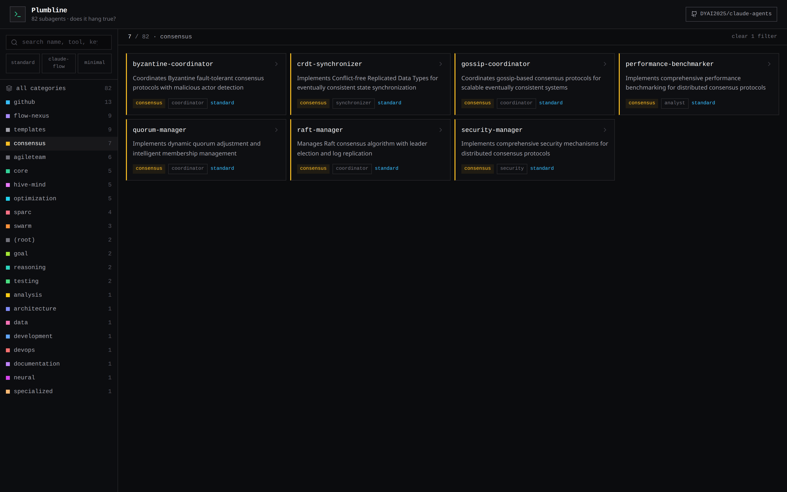
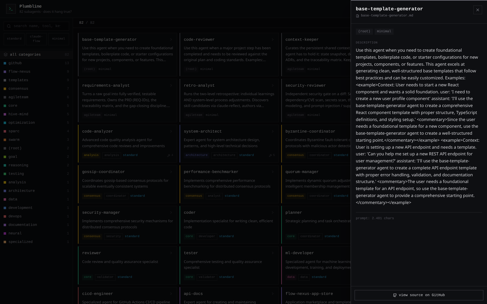

<div align="center">

# Plumbline

### *Does it hang true?*

**A defense-in-depth agent framework for Claude Code — built around one obsession: proving that work is *actually* done, not that it merely *looks* done.**

`86 subagents` · `16 vendored skills` · `/agileteam` v3 orchestrator · `/concilium` four-body council · `Reality-Ledger QA` · `empirically benchmarked`

**An agile AI agent framework for Claude Code: a self-learning, customer-value-governed agentic team that builds software with TDD gates, Kaizen retrospectives, and a defense-in-depth quality pipeline.**

`#ClaudeCode` `#ClaudeSkills` `#AgentFramework` `#AIAgents` `#AgenticAI` `#AgileAIAgents` `#AIAgile` `#AIAgenticAgileTeam` `#KaizenAgentic` `#SelfLearningAgileTeam` `#MultiAgentSystems` `#AgentEngineering` `#TDD` `#AutonomousCoding` `#DefenseInDepth` `#LLMOps`

> ### We benchmarked our own agent framework — and discovered our cleverest idea didn't work.
> Then we shipped the honest result anyway. **That** is Plumbline.

**[▶ Live demo](https://dyai2025.github.io/Plumbline/)** · explore all 86 agents in your browser, nothing to install

[](https://github.com/sponsors/DYAI2025)

<br/>


</div>

---

## Why "Plumbline"?

A plumb line is the oldest tool humanity has for checking whether something is **truly straight** — not whether it *looks* straight. You hang a weight on a string, and gravity gives you one honest reference that never lies.

That is exactly what this framework is for. It was born from a real failure: a feature whose tests were all green, yet the actual integration was a no-op — *"tests pass"* had been mistaken for *"it works."* Plumbline exists to hold every piece of agent-produced work against one honest reference: **does it hang true?**

In carpentry, *"true"* means both *correct* and *perfectly plumb*. That double meaning is the whole philosophy in one word.

### Plumbline identity (True-Line Governance)

Plumbline is an end-to-end product-building team framework. Its core invariant is staying true to confirmed human customer value across every quality gate. It does not treat green tests, completed tasks, or agent consensus as enough. Every gate must re-check whether the work remains real, useful, usable, production-grounded, and aligned with the user's confirmed Product Vision. In one line: **Plumbline does not optimize for finishing. Plumbline optimizes for staying true to confirmed human customer value; finishing is valid only when the line remains true.**

---

## What makes this different from "yet another agent list"

Most agent collections are prompt libraries. Plumbline is a prompt library **plus a measured, falsifiable claim about agent quality** — and we did the experiments to back it.

### The core finding (empirically benchmarked, not asserted)

We suspected a clever QA prompt ("always check you reached the *real* boundary, not a fake") would make agents catch the *"green-but-broken"* class of bug. So we built **mutation-oracle benchmarks**: give two agent variants the same task, let them write tests, then **secretly sabotage the code** and count which tests turn red (caught) vs. stay green (escaped). Deterministic. No vibes.

Across four independently-designed oracle corpora (`metrics/corpus/`), the honest result surprised us:

| What we measured | Result |
|---|---|
| QA prompt-discipline at the **test-planning** stage | **5× recall** at equal precision — real, kept |
| Same discipline at the **build-and-test** stage | **outcome-neutral** — the act of building already forces the agent to look |
| The decisive *"provided-fake"* trap (mirrors the original incident) | **only Opus catches it (0/3 escaped); Sonnet *and* Haiku escape it 3/3**|

**The lesson:** whether an agent's tests reach reality is governed by **model capability, not prompt cleverness.** A stronger prompt cannot give a weaker model that judgment. This is documented end-to-end — including the bugs the instrument caught *in itself* — in [`metrics/SUMMARY-2026-05-30-dna-investigation.md`](metrics/SUMMARY-2026-05-30-dna-investigation.md).

That intellectual honesty — *measuring* our own framework instead of marketing it — is the spirit of Plumbline.

### v0.10 — the discipline, measured end-to-end (`n=6` full-pipeline slice)

The oracle above tests one agent in isolation. In **v0.10** we measured the *whole pipeline*: a buried-gap build (`tester → coder → reviewer → production-validator`) run under two arms — the frozen-v3 agents vs. the evolved **Reality-Ledger DNA** — across a weak model (Haiku) and a strong one (Opus), scored by a **blind judge**. Two signals stood out:

We measured **both halves** of the ledger — catch-rate on planted gaps *and* false-positive ("cry-wolf") rate on pure-logic controls — and the honest answer is **not** "strictly better":

- ✅ **On Opus — a clean win.** Both arms catch every gap, but the frozen pipeline **cries wolf on 67% of pure-logic features** (demanding boundary tests a discount calculator doesn't need); the DNA's *"fires only on genuine boundary features, never on pure logic"* reflex cuts that to **17%**. **Same catch, ~4× less crying wolf.**
- ⚖️ **On a sub-Opus model — a trade-off, not a free lunch.** On Haiku the DNA **halves the boundary-defect escape rate (67% → 33%)** — but it **also raises the false-positive rate (0% → 33%).** The catch-gain on the weak model *is* partly bought with over-sensitivity. We say so plainly.

> **The scope is the point** — this is Plumbline: `n=6` per cell · 2 gap tasks + 2 control tasks · ~24M tokens across two runs · 240 coordinated agents · judge-scored. "The DNA is strictly better" would be a lie; **"net-positive on Opus, a trade-off on sub-Opus"** is the measured truth. Full ledger + setup → **[the transparent deep-dive →](docs/benchmarks/2026-06-02-full-pipeline.md)**.

### Built on that finding

- **Reality Ledger** — every requirement carries an *evidence class* (`unit-fake → integration-fake → real-boundary-smoke → production-verified`). Anything touching I/O, a remote, an external API or UI that stays `*-fake` is **RED regardless of green tests**, and that RED cannot be silently downgraded.
- **Wired-in-prod check** — a feature with a real implementation but no test through the production composition root is **not satisfiable**. The two costliest real-world misses ("exists in tests, never composed in prod") die here.
- **"Kritische semantische Glättung"** — a cheap, gated 3-beat QA reflex (thesis → counter-thesis → the one test that kills it) that fires only on genuine boundary features, never crying wolf on pure logic.

Plumbline even ships its own honesty as commands: **`/honest-status`** (separate *looks done* from *is done*, including what's unverified) and **`/bench-oracle`** (measure a change with a deterministic mutation oracle instead of asserting it works). The framework holds itself to its own plumb line.

---

## Features

- 🧭 **Customer-value governance ("True Line")** — a Product Canvas gate, a confirmed Product Vision, and an independent **Plumbline Watcher** keep every decision tied to real human value, not just green tests.
- 🤖 **`/agileteam` — an autonomous, self-organizing agile AI team** — requirements → TDD → independent review → security → validation → product judgment → human sign-off, end to end.
- ♻️ **Kaizen / self-learning loop** — a guarded retrospective turns recurring failures into persistent, evidence-checked process improvements (no blind self-modification).
- ⚖️ **`/concilium` — a four-body adversarial council** (Market · Tech · Skeptic · Distribution) that stress-tests a product idea *and* the team setup before you build.
- 🪜 **Defense-in-depth quality gates** — many diverse, uncorrelated checks (Gates A–E) so a defect must survive several independent reviewers, not one.
- 🔬 **Reality Ledger** — every requirement carries an evidence class; anything that stays fake/mock is **RED regardless of green tests**, and can't be silently downgraded.
- 📊 **Empirically benchmarked** — a deterministic mutation-oracle harness measures the agents themselves; we published the honest negative result, not just the wins.
- 🧩 **86 Claude Code subagents + 16 vendored skills** across 21 categories. Honest split: a small **Plumbline-engineered core** (~16 — the `/agileteam` pipeline, the `/concilium` council, the core TDD/governance roles) does the differentiating work; the majority (~70) are **vendored from the claude-flow agent base and shipped as a tested-workload dependency — prompts only, not individually benchmarked**, not "team members". (Count derived from the explorer extractor and drift-guarded; see `config/claude/tests/test_readme_honesty.sh`.)
- 🖥️ **Live Agent Explorer** — a zero-install web UI to search, filter, and inspect every agent ([live demo](https://dyai2025.github.io/Plumbline/)).
- 🛠️ **Portable & self-contained** — vendored skills + commands install with one script; works locally and in Claude Code on the web.

---

## What's inside

| Area | Count | Purpose |
|---|---:|---|
| `core/` | 5 | Base roles: `coder`, `planner`, `researcher`, `reviewer`, `tester` |
| `agileteam/` | 6 | `/agileteam` v3 workflow roles: requirements, spec-audit, PO, security, retro, context |
| `github/` | 13 | PR / issue / release / repo / workflow / multi-repo automation |
| `flow-nexus/` | 9 | Platform agents: sandbox, swarm, workflow, auth, payments, neural, … |
| `templates/` | 9 | Reusable agent templates and scaffolds |
| `consensus/` | 7 | Distributed-systems patterns: Byzantine, Raft, Gossip, CRDT, Quorum, … |
| `hive-mind/` | 5 | Queen / worker / scout / memory collective-intelligence patterns |
| `optimization/` | 5 | Performance, topology, resources, load-balancing, benchmarking |
| `sparc/` | 4 | SPARC phases: specification, pseudocode, architecture, refinement |
| `swarm/` | 3 | Swarm topologies: adaptive, hierarchical, mesh |
| `goal/`, `reasoning/`, `testing/` | 6 | GOAP planners, reasoning variants, TDD-London + production validation |
| domain specialists | 8 | analysis, architecture, ML, backend, CI/CD, API-docs, neural, mobile |
| `concilium/` | 4 | Four-body idea+team council: market-realist · tech-arbiter · skeptic · distribution-realist |
| `config/claude/skills/` | 16 | Vendored skills so workflows stay portable without external packs |
| `config/claude/commands/` | 7 | `/agileteam`, `/agileteam-bench`, `/concilium`, `/honest-status`, `/bench-oracle`, `/reflect`, `/reflect-skills` |

Browse them all visually in the **Agent Explorer** (see below).

<table>
<tr>
<td width="50%"></td>
<td width="50%"></td>
</tr>
<tr>
<td align="center"><em>Colour-coded categories, instant filtering</em></td>
<td align="center"><em>Per-agent detail: tools, triggers, source link</em></td>
</tr>
</table>

---

## The Agent Explorer

`agent-explorer.html` is a self-contained, dependency-free snapshot of the whole
collection — a dark terminal-style UI with colour-coded categories, full-text search
over names/tools/keywords, schema filters, and a per-agent detail drawer that links
straight to the source on GitHub. **[Try the live demo →](https://dyai2025.github.io/Plumbline/)**
or open `agent-explorer.html` in any browser; nothing to install.

Regenerate it after editing agents:

```bash
./build-explorer.sh   # re-extracts frontmatter → rebuilds the bundle + docs/index.html (the live demo)
```

---

## `/agileteam` v3 — an autonomous TDD team with real gates

`/agileteam <feature>` orchestrates a full delivery pipeline of independent agents.
The governing stance: **there is no "100% safe" (Rice's theorem) — so chain many
*diverse, independent* checks, such that a defect would have to survive several
uncorrelated gates.**

0. **Product Canvas** — a mandatory upstream value-alignment gate: problem, target user, value proposition, success signal, core use case, non-goals, risks, evidence needed — saved to `docs/canvas/<feature>.canvas.md` and **explicitly user-confirmed before the PRD is finalized or development starts** (no agent may self-confirm it)
1. **Requirements** — PRD, REQ-IDs, acceptance criteria, traceability matrix
2. **Spec sanity** — ultrathink + konfabulation audit (claim-provenance check)
3. **Planning** — architecture, atomic tasks, sequence
4. **TDD loop** — coder writes the failing test first, then minimal impl
5. **Independent review** — reviewer sees diff + spec, never the coder's reasoning
6. **Security review** — SAST / deps / secrets / threat + injection surface
7. **Validation** — per-REQ pass/fail against the matrix, with evidence
8. **Judgment gate** — product-owner: *did we build the right thing?*
9. **Human acceptance** — sign-off stays explicitly human
10. **Retro / learning loop** — process improvements, persisted only under guardrails

**Independence invariant:** whoever writes code does not review it; whoever derives
tests does not implement them.

> **In active development:** an expanded autonomous, customer-value-governed pipeline
> (token-bounded council challenge gate, Vision-GO → hands-off run, per-increment
> Code-reviewer→QA→Watcher value checks, live `N/M` iteration progress) is reviewed on a
> feature branch but not yet merged — see [`dev-plan.md`](dev-plan.md) for the honest
> roadmap and validation status.

### Model policy (measured, not guessed)

Per the benchmark above, the *reach-the-real-boundary* judgment lives in **model
capability**. The orchestrator therefore defaults all roles to your session model
(`/model`), discloses once at run start that the GBrain-class safety net on the
checking gates is only guaranteed on Opus, and — only if you opt in — dispatches just
those five gates on Opus. No silent up- or down-grading. (We also verified that
per-agent `model:` frontmatter is *not* applied by the current Claude Code runtime;
only an explicit dispatch parameter takes effect — so control lives in the
orchestrator, transparently.)

### CORE vs FULL

| Mode | Goal | Self-modification |
|---|---|---|
| `core` (default) | Safe, runnable baseline | None — learnings stay human-gated |
| `full` | Autonomous evolution (canary + auto-revert) | Only once a `metrics/runs.jsonl` baseline exists |

---

## Quickstart

```bash
git clone https://github.com/DYAI2025/Plumbline plumbline
cd plumbline
./config/claude/install.sh        # symlinks repo → ~/.claude/agents, installs commands/skills/hook
                                  # add --copy on Windows / if you prefer copies
```

Then, in any project:

```bash
/agileteam "add OAuth2 login with refresh-token rotation"
```

Requirements: `git`, `bash`, `python3`, and `jq` (for hook registration). Full
portability, web-session bootstrap, and per-project gate tooling are covered in
[`SETUP.md`](SETUP.md).

---

## Quality assurance

```bash
# validate every agent's frontmatter (parse errors / missing description / duplicate names)
bash config/claude/tests/run_all.sh
```

The CI suite checks frontmatter, metrics scripts, settings JSON, the stop-hook, the
web bootstrap, and (if installed) shell scripts via `shellcheck`.

---

## Repository layout

```text
.
├── core/                      # coder, planner, researcher, reviewer, tester
├── agileteam/                 # /agileteam workflow roles
├── github/ swarm/ hive-mind/  # automation + coordination agents
├── consensus/ sparc/ …        # distributed-systems + methodology agents
├── config/claude/commands/    # slash commands  (/agileteam, /reflect, …)
├── config/claude/skills/      # 16 vendored fallback skills
├── config/claude/hooks/       # SessionStart + learning-loop Stop hook
├── metrics/                   # the benchmark corpora + the honest write-ups
├── explorer/                  # source for agent-explorer.html
├── docs/                      # /agileteam spec v3 + governance
│   ├── canvas/                # docs/canvas — user-confirmed Product Canvas artifacts
│   └── templates/             # docs/templates — Product Canvas + workflow templates
├── README.md  SETUP.md  CLAUDE.md
```

---

## Design principles

- **Evidence over vibes** — claims must be backed by code, tests, logs, or an explicit assumption; missing tooling is marked `MISSING`, never fantasised as passing.
- **Roles stay sharp** — a good agent has one crisp job, not a generic "do everything" identity.
- **Independence matters** — review, test, security and product judgment must not just echo the coder's perspective.
- **Human gates stay** — especially for requirements, product decisions, and persistent self-improvement.
- **Version prompts like code** — every agent change gets a diff, review, and validation.

---

## Support / sponsor the benchmarks

Plumbline's central claims are *measured*, not asserted — and measuring them costs real model tokens. Every oracle corpus run re-executes agent variants, **secretly sabotages the code**, and counts which tests turn red (caught) vs. stay green (escaped), across Haiku, Sonnet and Opus. Sponsorship goes straight into that compute, so the empirical instrument stays honest, reproducible, and able to grow new corpora.

[](https://github.com/sponsors/DYAI2025)

| Tier | What your contribution funds |
|---|---|
| **Haiku Supporter** · 5 €/mo | The daily smoke tests — keeps the repo's CORE oracle checks green every day. |
| **Opus Validator** · 25 €/mo | A compute-heavy `FULL`-mode deep evaluation run — including the *provided-fake* trap that **only Opus** catches (0/3 escaped) while Sonnet and Haiku escape it 3/3. |
| **Enterprise Governance Patron** · 100 €/mo | For teams running Plumbline in production — sustained benchmarking plus a seat at the table for governance / Reality-Ledger priorities. |

Sponsorship is best-effort support for an open-source project — not a paid product, SLA, or feature guarantee. Thank you for helping keep the line true.

---

## License & attribution

[MIT](LICENSE) © 2026 DYAI2025.

The agent base is derived in part from **Claude Flow** by [`ruvnet`](https://github.com/ruvnet/) (MIT, © ruvnet) — the repo path [`ruvnet/claude-flow`](https://github.com/ruvnet/claude-flow) now points to [`ruvnet/ruflo`](https://github.com/ruvnet/ruflo). Keep this attribution and the MIT notice when redistributing forks or major rewrites.

<div align="center">

---

**Plumbline** — *if you only need a single prompt, this is overkill. If you want to build, inspect, and evolve auditable agent systems that prove they hang true: welcome to the machine room.*

`#AIEngineering` `#AgentOrchestration` `#PromptEngineering` `#AutonomousAgents` `#CollectiveIntelligence` `#AgenticWorkflow` `#ClaudeAgents` `#FutureOfSoftwareDevelopment`

</div>
